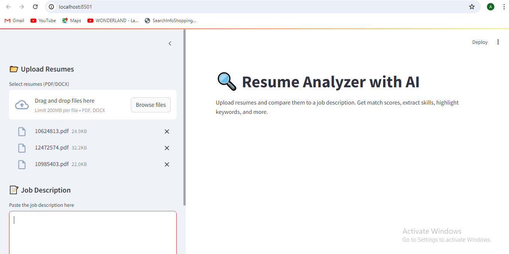
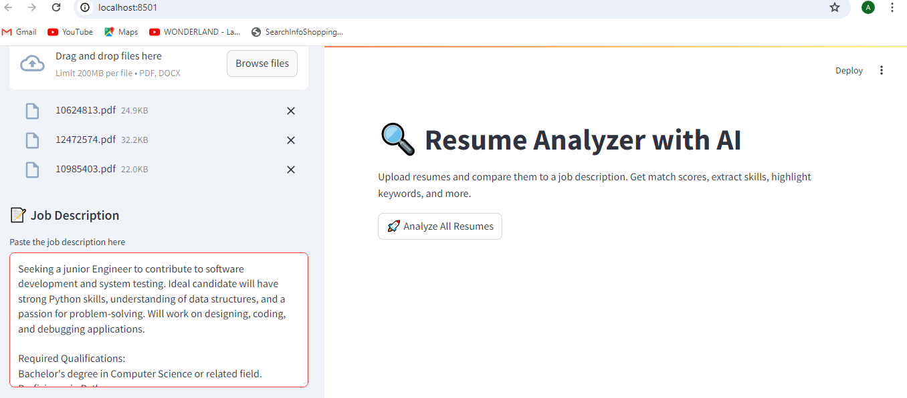
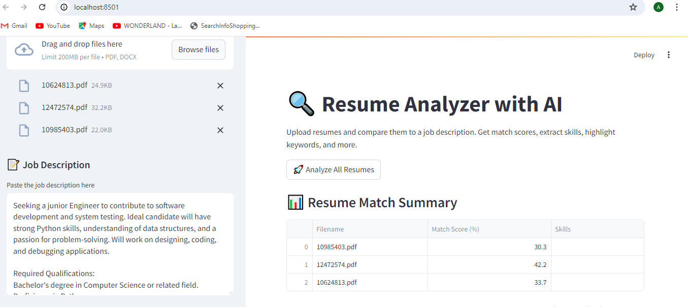
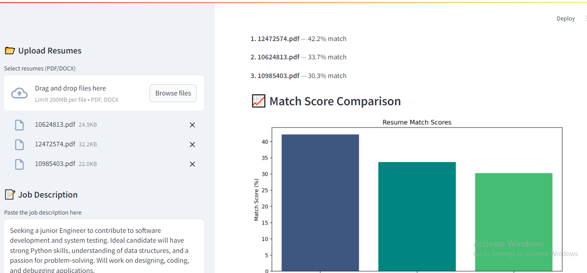

# 📄 AI Resume Analyzer

This is a Streamlit-based AI-powered Resume Analyzer that matches resumes against job descriptions and extracts skills using NLP.

## 🚀 Features

- Upload resumes in PDF or DOCX
- Paste job description to compare
- Uses AI (spaCy) to extract skills
- Calculates compatibility match score
- Clean, simple UI with Streamlit
- Save results as CSV

## 🛠️ Tech Stack

- Python
- Streamlit
- spaCy (NLP)
- scikit-learn (TF-IDF & Cosine Similarity)
- PyPDF2 / python-docx

## 📦 Installation

1. **Clone this repository**
   ```bash
   git clone https://github.com/pyfreelancer/ai-resume-analyzer.git
   cd ai-resume-analyzer

2- Install dependencies:
Ensure you have pip installed, then install all required libraries using the requirements.txt file (you will need to generate this file first if you haven't already by running pip freeze > requirements.txt in your activated virtual environment).

pip install -r requirements.txt

3- Download the spaCy language model:
This project specifically uses the large English model from spaCy.
python -m spacy download en_core_web_lg

4- Run the Streamlit application:
Once all dependencies are installed, navigate to the project's root directory in your terminal and run the Streamlit application.

streamlit run app.py # Or replace 'app.py' with the actual name of your main Streamlit file (e.g., 'main.py')
Your web browser should automatically open to the Streamlit application (usually http://localhost:8501).

🚀 Usage
1- Upload Resumes: Use the file uploader widget to select one or more PDF or DOCX resume files.

2- Enter Job Description: Provide the job description text in the designated input area.

3- Analyze: Click the "Analyze" or "Process" button (or similar, depending on your UI) to start the analysis.

4- Review Results: View the match scores, extracted skills, highlighted keywords, and any other insights directly in the web interface.

5- Export: If available, use the export option to download results as a CSV.

## 🖼️ Screenshots / Demo

### Initial Application Screen (Upload Resumes & Job Description)


### Job Description Input and Analyze Button


### Resume Match Summary Table


### Match Score Comparison Chart


💡 Future Enhancements
Advanced Skill Matching: Incorporate more sophisticated skill matching algorithms or external skill taxonomies.

Resume Generation Feedback: Provide direct, actionable feedback for resume improvement based on analysis.

User Accounts & History: Allow users to save their analysis history.

Deployment: Prepare the application for cloud deployment (e.g., on Heroku, AWS, Google Cloud).

More File Types: Support additional resume formats if needed.

👋 Contributing
Contributions are welcome! If you have suggestions for improvements or new features, feel free to:

Fork the repository.

Create a new branch (git checkout -b feature/your-feature-name).

Make your changes.

Commit your changes (git commit -m 'feat: Add new feature').

Push to the branch (git push origin feature/your-feature-name).

Open a Pull Request.

📄 License
This project is licensed under the MIT License - see the LICENSE file for details.

MIT License

Copyright (c) 2025 [pyfreelancer]

Permission is hereby granted, free of charge, to any person obtaining a copy
of this software and associated documentation files (the "Software"), to deal
in the Software without restriction, including without limitation the rights
to use, copy, modify, merge, publish, distribute, sublicense, and/or sell
copies of the Software, and to permit persons to whom the Software is
furnished to do so, subject to the following conditions:

The above copyright notice and this permission notice shall be included in all
copies or substantial portions of the Software.

THE SOFTWARE IS PROVIDED "AS IS", WITHOUT WARRANTY OF ANY KIND, EXPRESS OR
IMPLIED, INCLUDING BUT NOT LIMITED TO THE WARRANTIES OF MERCHANTABILITY,
FITNESS FOR A PARTICULAR PURPOSE AND NONINFRINGEMENT. IN NO EVENT SHALL THE
AUTHORS OR COPYRIGHT HOLDERS BE LIABLE FOR ANY CLAIM, DAMAGES OR OTHER
LIABILITY, WHETHER IN AN ACTION OF CONTRACT, TORT OR OTHERWISE, ARISING FROM,
OUT OF OR IN CONNECTION WITH THE SOFTWARE OR THE USE OR OTHER DEALINGS IN THE
SOFTWARE.

✉️ Contact
For any questions or collaborations, feel free to reach out:

GitHub Username:[ pyfreelancer]
Email: [areejsajjad44@gmail.com]